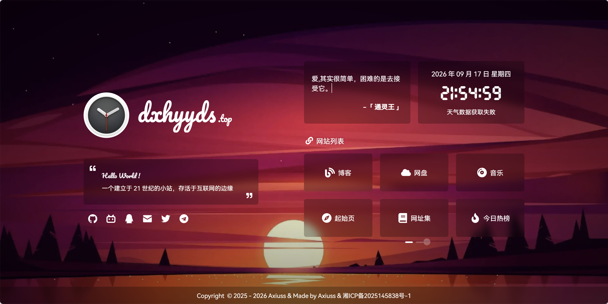

# 研习轩 · 个人主页

一个用来聚合个人简介、社交入口、常用站点、一言、时间天气与时光进度的单页个人主页。



---

## 关于本项目

个人自用的主页项目，基于 Vue 3 + Vite 构建，站点信息均在 `.env` 中配置，可自行 Fork 修改后部署。

|          | 本项目                             |
| -------- | ---------------------------------- |
| 作者     | Axiuss                             |
| 仓库     | 本仓库（个人自用）                 |
| 站点     | [dxhyyds.top](https://dxhyyds.top) |
| 站点名称 | 研习轩                             |
| 协议     | MIT                                |

### 主要特点

- **站点信息可配置**：站点名称、作者、简介、关键词、备案号、建站日期均在 `.env` 中配置。
- **社交链接与站点链接**：在 `src/assets/` 下的 JSON 中维护。
- **音乐播放器**：可关闭（`.env` 中 `VITE_SONG_ID` 留空时不会渲染播放器）。
- **素材本地化**：站点图标与壁纸均为本地素材，也可切换为每日一图等在线图源。

---

## 功能

- 载入动画
- 站点简介卡片
- Hitokoto 一言（点击可换一句）
- 日期与实时时间
- 实时天气（高德开放平台，未配置 Key 时回落到备用接口）
- 时光胶囊：今日 / 本周 / 本月 / 本年进度，以及建站天数统计
- 音乐播放器（基于 APlayer + Meting API，本项目默认关闭）
- 壁纸切换：默认壁纸 / 每日一图 / 随机风景 / 随机动漫
- 鼠标中键快速进入壁纸展示模式
- PWA 离线缓存
- 移动端适配

---

## 技术栈

- [Vue 3](https://cn.vuejs.org/)（`<script setup>` 语法）
- [Vite](https://cn.vitejs.dev/)
- [Pinia](https://pinia.vuejs.org/zh/)（含 `pinia-plugin-persistedstate` 本地持久化）
- [Element Plus](https://element-plus.org/zh-CN/)（按需自动引入）
- [IconPark](https://iconpark.oceanengine.com/official) / [xicons](https://xicons.org/) 图标
- [Swiper](https://swiperjs.com/) 站点链接轮播
- [APlayer](https://aplayer.js.org/) 音乐播放器
- [vite-plugin-pwa](https://vite-pwa-org.netlify.app/) + Workbox
- Sass（SCSS）

---

## 快速开始

```bash
# 安装依赖
pnpm install

# 启动开发服务器（默认 http://localhost:3000，会自动打开浏览器）
pnpm dev

# 构建生产版本，产物输出到 dist/
pnpm build

# 本地预览构建产物
pnpm preview

# 代码格式化 / 检查
pnpm format
pnpm lint
```

> 实测环境：Node.js v22.22.2 + pnpm，构建约 27 秒。理论上 Node 18 及以上均可运行。

### 首次配置

1. 复制 `.env.example` 为 `.env`（**必须**，否则站点信息、图标全部为空）
2. 按下方说明填写 `.env` 中的各项配置
3. 按需修改 `src/assets/siteLinks.json` 与 `src/assets/socialLinks.json`

```bash
cp .env.example .env
```

---

## 配置说明（.env）

`.env` 已被 `.gitignore` 忽略，不会进入版本库。所有变量都以 `VITE_` 开头，构建时会被静态替换进代码，因此**不要往里放任何私密密钥**（前端代码中的 Key 对访客是可见的）。

### 站点信息

| 变量                   | 说明                                                          |
| ---------------------- | ------------------------------------------------------------- |
| `VITE_SITE_NAME`       | 站点名称，显示在加载动画与浏览器标题                          |
| `VITE_SITE_AUTHOR`     | 作者名，显示在底栏版权处                                      |
| `VITE_SITE_KEYWORDS`   | 页面 `keywords`                                               |
| `VITE_SITE_DES`        | 页面 `description`                                            |
| `VITE_SITE_URL`        | 站点地址，可带 `http(s)://`，也可只写域名（底栏会自动补协议） |
| `VITE_SITE_LOGO`       | 浏览器标签页图标，指向 `public/` 下的路径                     |
| `VITE_SITE_MAIN_LOGO`  | 主页头像，指向 `public/` 下的路径                             |
| `VITE_SITE_APPLE_LOGO` | iOS 添加到主屏的图标，指向 `public/` 下的路径                 |

### 简介文本

| 变量                    | 说明                           |
| ----------------------- | ------------------------------ |
| `VITE_DESC_HELLO`       | 简介卡片第一行（默认态）       |
| `VITE_DESC_TEXT`        | 简介卡片正文（默认态）         |
| `VITE_DESC_HELLO_OTHER` | 点击简介卡片展开盒子后的第一行 |
| `VITE_DESC_TEXT_OTHER`  | 点击简介卡片展开盒子后的正文   |

### 其他

| 变量               | 说明                                                             |
| ------------------ | ---------------------------------------------------------------- |
| `VITE_WEATHER_KEY` | 高德开放平台 **Web 服务** 类型 Key；留空则使用第三方备用天气接口  |
| `VITE_SITE_START`  | 建站日期，格式 `YYYY-MM-DD`（也可只写年份 `YYYY`）；留空则不显示  |
| `VITE_SITE_ICP`    | ICP 备案号；留空则不显示                                         |

### 音乐播放器

| 变量               | 说明                                                |
| ------------------ | --------------------------------------------------- |
| `VITE_SONG_API`    | Meting API 地址                                     |
| `VITE_SONG_SERVER` | `netease`（网易云）或 `tencent`（QQ 音乐）          |
| `VITE_SONG_TYPE`   | `song` / `playlist` / `album` / `search` / `artist` |
| `VITE_SONG_ID`     | 歌曲或歌单 ID；**留空则整个播放器不渲染**           |

### 控制模块显隐的小技巧

- 想关掉音乐播放器 → `VITE_SONG_ID` 留空
- 想关掉建站天数统计 → `VITE_SITE_START` 留空
- 想关掉备案号 → `VITE_SITE_ICP` 留空
- 想换掉天气数据源 → `VITE_WEATHER_KEY` 留空，会自动回落到 `api.oioweb.cn`

---

## 定制指南

### 网站链接（右侧九宫格）

在 `src/assets/siteLinks.json` 中配置，每 6 项为一页自动分页：

```json
[
  {
    "icon": "Blog",
    "name": "博客",
    "link": "https://example.com"
  }
]
```

`icon` 的可用取值来自 `src/components/Links.vue` 中引入的图标集合：

```js
// 可前往 https://www.xicons.org 自行挑选并在此处引入
// 此处引入的是 fa 类型
import { Link, Blog, CompactDisc, Cloud, Compass, Book, Fire, LaptopCode } from "@vicons/fa";

// 网站链接图标
const siteIcon = {
  Blog,
  Cloud,
  CompactDisc,
  Compass,
  Book,
  Fire,
  LaptopCode,
};
```

新增图标时：先在 `Links.vue` 顶部 import，再把它加进 `siteIcon` 对象，最后在 JSON 里按名字引用。

> 注意：`name` 为「音乐」的那一项有特殊逻辑 —— 开启设置面板中的「音乐点击是否打开面板」后，点击它会打开播放器面板而不是跳转外链。

### 社交链接（左侧图标行）

在 `src/assets/socialLinks.json` 中配置：

```json
[
  {
    "name": "Github",
    "icon": "/images/icon/github.png",
    "tip": "去 Github 看看",
    "url": "https://github.com/yourname"
  }
]
```

`icon` 指向 `public/images/icon/` 下的图片，`tip` 是鼠标悬停时右侧显示的提示语。

> ⚠️ `url` 请不要留空。空字符串会被浏览器解析为「当前页面地址」，点击后会变成刷新整页；不需要的项请直接从 JSON 数组中删除。

### 壁纸

本地壁纸放在 `public/images/` 下，命名规则为 `background + 数字 + .webp`。

新增壁纸后，需要同步修改 `src/components/Background.vue` 中的图片数量：

```js
// 壁纸随机数
// 请依据文件夹内的图片个数修改 Math.random() 后面的第一个数字
const bgRandom = Math.floor(Math.random() * 10 + 1);
```

壁纸类型在页面设置面板中切换（默认壁纸 / 每日一图 / 随机风景 / 随机动漫），选择结果会保存在浏览器 localStorage 中。

### 网站图标

替换 `public/images/icon/` 下的文件即可，常用文件：

- `favicon.ico` — 浏览器标签页图标
- `logo.png` — 主页头像
- `apple-touch-icon.png` — iOS 添加到主屏图标
- `48 / 72 / 96 / 128 / 144 / 192 / 512` 系列 PNG — PWA 图标

> PWA 图标清单定义在 `vite.config.js` 的 `VitePWA` 插件配置中，新增尺寸需要同步更新 `manifest.icons`。

### 字体

- **Logo 字体**：`src/style/style.scss` 中通过 `@font-face` 引入 `/font/Pacifico-Regular.woff2`。完整版 TTF 字体保留在 `docs/font/Pacifico-Regular-all.ttf`，若只想保留 Logo 用到的字符，可用它做子集替换后重新转 woff2，并同步修改 `style.scss` 中的 `src` 路径。
- **中文字体**：采用 `HarmonyOS Sans`，在 `index.html` 中通过外部 CDN 引入。原项目的 CDN 开启了防盗链，非原项目域名无法访问，因此这里改用：

  ```html
  <link rel="stylesheet" href="https://s1.hdslb.com/bfs/static/jinkela/long/font/regular.css" />
  ```

  该字体来自第三方站点，若担心可用性，建议自行托管该 CSS 与字体文件。

### 更新日志内容

设置面板左侧的更新日志是写死的，位于 `src/views/MoreSet/index.vue` 的 `upData` 中：

```js
const upData = reactive({
  new: ["...", "..."],
  fix: ["...", "..."],
});
```

### 盒子（右侧详情面板）内容

默认是一个占位组件 `src/components/MoreContent.vue`，可以在其中放置任意想展示的内容。当前盒子内已包含「时光胶囊」组件，挂载位置在 `src/views/Box/index.vue`。

---

## 部署

### 静态托管（推荐）

```bash
pnpm build
```

构建产物在 `dist/` 目录，直接将该目录下的文件上传到任意静态服务器 / 对象存储即可。

### Docker

```bash
docker build -t home .
docker run -p 12445:12445 -d home
```

或使用 compose：

```bash
docker compose up -d
```

> `Dockerfile` 中会在缺少 `.env` 时尝试复制 `.env.example`。**请确保构建上下文里有 `.env` 或 `.env.example`**，否则构建出的站点会缺失全部站点信息。

### Vercel / Netlify 等平台

1. 将仓库导入平台
2. 在平台的环境变量设置中，按 `.env.example` 逐项填入 `VITE_*` 变量
3. 构建命令填 `pnpm build`，输出目录填 `dist`

> 本项目是纯前端应用，没有服务端依赖，任何静态托管方式都可以。

---

## 目录结构

```
home-dev/
├─ public/                          # 不参与打包，原样拷贝到 dist
│  ├─ font/                         # 字体文件（woff2）
│  └─ images/
│     ├─ background1~10.webp        # 本地壁纸
│     └─ icon/                      # 站点图标、社交图标
├─ docs/                            # 不上线的资料：字体原始 TTF、壁纸原图、上游文件
├─ screenshots/                     # README 配图
├─ src/
│  ├─ api/index.js                  # 一言 / 高德天气 / 歌单接口封装
│  ├─ assets/
│  │  ├─ siteLinks.json             # 网站链接配置
│  │  └─ socialLinks.json           # 社交链接配置
│  ├─ components/                   # 背景、底栏、一言、音乐、播放器、设置面板等
│  ├─ store/index.js                # Pinia 全局状态（部分字段持久化到 localStorage）
│  ├─ style/
│  │  ├─ global.scss                # 全局变量与 mixin
│  │  └─ style.scss                 # 全局样式，仅在 main.js 中引入一次
│  ├─ utils/                        # 时间处理、防抖、自定义鼠标
│  ├─ views/
│  │  ├─ Main/                      # 主界面左右两栏
│  │  ├─ Box/                       # 右侧盒子面板
│  │  ├─ Func/                      # 时间与天气功能区
│  │  └─ MoreSet/                   # 设置页
│  ├─ App.vue                       # 根组件，负责整体布局与全局事件
│  └─ main.js                       # 入口
├─ index.html                       # 入口 HTML，通过 %VITE_*% 注入站点信息
├─ vite.config.js                   # Vite / PWA / SCSS 配置
├─ Dockerfile                       # 构建 + 运行镜像（pnpm 构建 + nginx 运行）
├─ nginx.conf                       # 镜像内的静态服务器配置（gzip_static / 缓存策略）
├─ docker-compose.yml
└─ .env                             # 本地配置，不入库
```

> 关于 `src/style/global.scss`：它通过 `vite.config.js` 的 `additionalData` 被注入到**每一个** SCSS 块中，因此请只在这里放变量、mixin 和函数，不要写会实际输出 CSS 的规则，否则每个组件的样式里都会多出一份。

---

## 待办 / 已知问题

- [ ] `src/assets/socialLinks.json` 与 `siteLinks.json` 中仍有多项 `url` / `link` 为空。当前代码已有兜底（空链接点击只提示、不跳转），不需要的条目建议直接从 JSON 数组中删除
- [ ] `.env` 中的高德天气 Key 与 Meting 歌单 API 为公共服务，建议自行申请/部署后替换
- [ ] `backdrop-filter` 在低端设备上的性能开销可再观察优化
- [ ] 中文字体（HarmonyOS Sans）目前依赖第三方 CDN，可考虑自行托管

---

## 致谢

用到的第三方服务与接口：

- [Hitokoto 一言](https://hitokoto.cn/)
- [高德开放平台](https://lbs.amap.com/)
- [教书先生 API](https://api.oioweb.cn/doc/weather/GetWeather)
- [韩小韩 WebAPI](https://api.vvhan.com/)
- [搏天 API](https://api.btstu.cn/doc/sjbz.php)

## 许可

[MIT](./LICENSE) © 2025-2026 Axiuss
